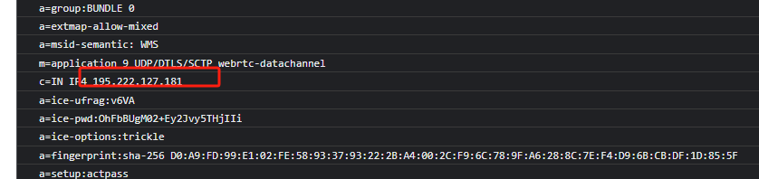

# WebRTC 使用信令服务获取客户端真实ip，无须用户授权

## 安装启动

npm i -g node-stun

node-stun-server

## 访问html 
    注意：需要修改html中stun地址为你的stun地址
    同一台电脑启动启动服务只能查到  0.0.0.0 / 127.0.0.1 的，
    可以使用一些代理浏览器模拟客户端浏览器访问，就可以看到客户端ip:
        
    